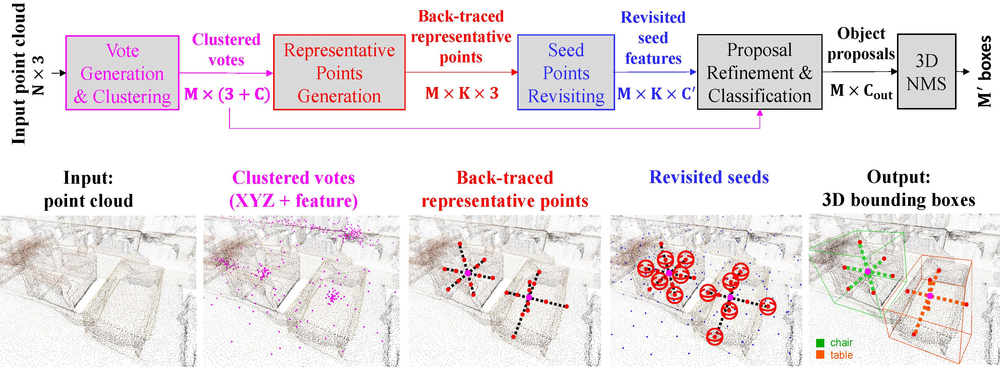

# BRNet



## Introduction

This is a release of the code of our paper ***Back-tracing Representative Points for Voting-based 3D Object Detection in Point Clouds***, CVPR 2021.

**Authors**: Bowen Cheng, Lu Sheng\*, Shaoshuai Shi, Ming Yang, Dong Xu (\*corresponding author)

[[arxiv]](https://arxiv.org/abs/2104.06114)

In this repository, we *reimplement* BRNet based on [mmdetection3d](https://github.com/open-mmlab/mmdetection3d) for easier usage.

## Citation

If you find our work useful in your research, please consider citing:

```
@inproceedings{cheng2021brnet,
  title={Back-tracing Representative Points for Voting-based 3D Object Detection in Point Clouds},
  author={Cheng, Bowen and Sheng, Lu and Shi, Shaoshuai and Yang, Ming and Xu, Dong},
  booktitle={Proceedings of the IEEE/CVF Conference on Computer Vision and Pattern Recognition},
  year={2021}
}
```

## Installation

This repo is built based on [mmdetection3d](https://github.com/open-mmlab/mmdetection3d) (V0.11.0), please follow the [getting_started.md](https://github.com/cheng052/BRNet/blob/master/docs/getting_started.md) for installation.

The code is tested under the following environment:

- Ubuntu 16.04 LTS
- Python 3.7.10
- Pytorch 1.5.0
- CUDA 10.1
- GCC 7.3

## Datasets

### ScanNet

Please follow the instruction [here](https://github.com/cheng052/BRNet/tree/master/data/scannet) to prepare ScanNet Data.

### SUN RGB-D

Please follow the instruction [here](https://github.com/cheng052/BRNet/tree/master/data/sunrgbd) to prepare SUN RGB-D Data.

## Download Trained Models

We provide the trained models of ScanNet and SUN RGB-D with per-class performances.

- ScanNet
  - [GoogleDrive](https://drive.google.com/drive/folders/1a_J2tkJOuRyHYefgCnFiWAfRZfXcOJZy?usp=sharing)
  - [BaiduNetdisk](https://pan.baidu.com/s/1U0M8b7POs7iOR4ufSXXw4g) (Extraction Code: hv29)
- SUN RGB-D
  - [GoogleDrive](https://drive.google.com/drive/folders/1vhGggucf7pJihfKahfJlL4lFZp2DEHdT?usp=sharing)
  - [BaiduNetdisk](https://pan.baidu.com/s/1I0rR6WcPTBuD9Bdw1K2eCQ) (Extraction Code: gnzu)

| ScanNet V2     | AP_0.25    | AR_0.25 | AP_0.50    | AR_0.50 |
| -------------- | ---------- | ------- | ---------- | ------- |
| cabinet        | 0.4898     | 0.7634  | 0.2800     | 0.5349  |
| bed            | 0.8849     | 0.9506  | 0.7915     | 0.8642  |
| chair          | 0.9149     | 0.9357  | 0.8354     | 0.8604  |
| sofa           | 0.9049     | 0.9794  | 0.8027     | 0.9278  |
| table          | 0.6802     | 0.8486  | 0.6146     | 0.7600  |
| door           | 0.5955     | 0.7430  | 0.3721     | 0.5418  |
| window         | 0.4814     | 0.7092  | 0.2405     | 0.4078  |
| bookshelf      | 0.5876     | 0.8701  | 0.5032     | 0.7532  |
| picture        | 0.1716     | 0.3243  | 0.0687     | 0.1396  |
| counter        | 0.6085     | 0.8846  | 0.3545     | 0.5385  |
| desk           | 0.7538     | 0.9528  | 0.5481     | 0.7874  |
| curtain        | 0.6275     | 0.7910  | 0.4126     | 0.5224  |
| refrigerator   | 0.5467     | 0.9474  | 0.4882     | 0.8070  |
| showercurtrain | 0.7349     | 0.9643  | 0.5189     | 0.6786  |
| toilet         | 0.9896     | 1.0000  | 0.9227     | 0.9310  |
| sink           | 0.5901     | 0.6735  | 0.3521     | 0.4490  |
| bathtub        | 0.8605     | 0.9355  | 0.8565     | 0.9032  |
| garbagebin     | 0.4726     | 0.7151  | 0.3169     | 0.5170  |
| Overall        | **0.6608** | 0.8327  | **0.5155** | 0.6624  |

| SUN RGB-D   | AP_0.25    | AR_0.25 | AP_0.50    | AR_0.50 |
| ----------- | ---------- | ------- | ---------- | ------- |
| bed         | 0.8633     | 0.9553  | 0.6544     | 0.7592  |
| table       | 0.5136     | 0.8552  | 0.2981     | 0.5268  |
| sofa        | 0.6754     | 0.8931  | 0.5830     | 0.7193  |
| chair       | 0.7864     | 0.8723  | 0.6301     | 0.7137  |
| toilet      | 0.8699     | 0.9793  | 0.7125     | 0.8345  |
| desk        | 0.2929     | 0.8082  | 0.1134     | 0.4017  |
| dresser     | 0.3237     | 0.7615  | 0.2058     | 0.4954  |
| night_stand | 0.5933     | 0.8627  | 0.4490     | 0.6588  |
| bookshelf   | 0.3394     | 0.7199  | 0.1574     | 0.3652  |
| bathtub     | 0.7505     | 0.8776  | 0.5383     | 0.6531  |
| Overall     | **0.6008** | 0.8585  | **0.4342** | 0.6128  |

**Note**: Due to the detection results are unstable and fluctuate within 1~2 mAP points, the results here are slightly different from those in the paper.

## Training

For ScanNet V2, please run:

```sh
CUDA_VISIBLE_DEVICES=0 python tools/train.py configs/brnet/brnet_8x1_scannet-3d-18class.py --seed 42
```

For SUN RGB-D, please run:

```shell
CUDA_VISIBLE_DEVICES=0 python tools/train.py configs/brnet/brnet_8x1_sunrgbd-3d-10class.py --seed 42
```

## Demo

To test a 3D detector on point cloud data, please refer to [Single modality demo](https://mmdetection3d.readthedocs.io/en/latest/0_demo.html) and [Point cloud demo](https://mmdetection3d.readthedocs.io/en/latest/getting_started.html#demo) in MMDetection3D docs.

Here, we provide a demo on SUN RGB-D dataset.

```shell
CUDA_VISIBLE_DEVICES=0 python demo/pcd_demo.py sunrgbd_000094.bin demo/brnet_8x1_sunrgbd-3d-10class.py checkpoints/brnet_8x1_sunrgbd-3d-10class_trained.pth
```

## Visualization results

### ScanNet


### SUN RGB-D


## Acknowledgments

Our code is heavily based on [mmdetection3d](https://github.com/open-mmlab/mmdetection3d). Thanks mmdetection3d Development Team for their awesome codebase.